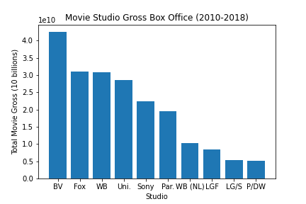
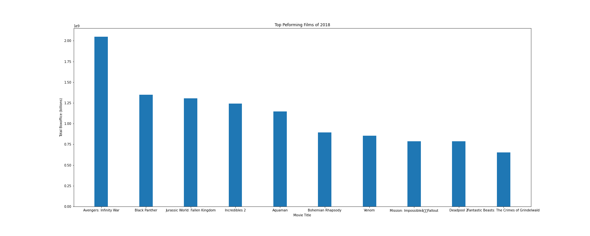
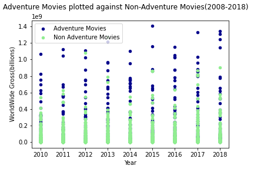
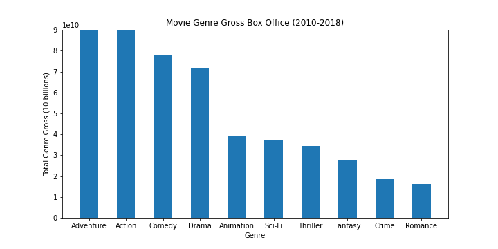
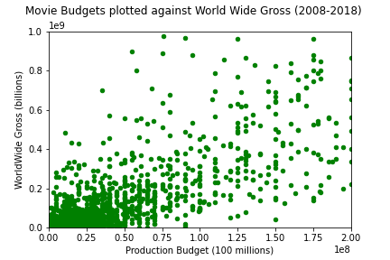

# Microsoft Movie Studios Technical Analysis 

## Overview
Companies coming out with studios to to produce film and tv content are becoming more and more the norm. In an industry that used to only have a few powerful players, digital media has allowed all types of companies to start their own streaming/movies studios. Content has never been more accesible for the consumer and this is causing many existing companies to try to get into the media business. 

## Business Problmem
The question behind this analysis was that Microsoft wants to start its own movie studio, but they are not sure where to begin. They have no industry knowledge and need someone to conduct a data analsysis of films currenlty performing well at the box office. I have conducted said analysis and come up with 3 business recomendations for Microsoft to use. Microsoft can use these recommendations to try become a profitable studio in a short amount of time.  
## Data

The data that was used in this study was taken from four seperate data frames. The first two were taken from imdb which is an online database containing data related to films, televesion programs and other media information. The third data base that used held information on box office numbers such as gross and genre of film. The fourth data frame used held similar data to the third dataframe in that it had box office gross information. 

## Methods 
This was a descriptive analysis that focused that looked closey at the films and type of films that performing well financially in recent years. From this a new stusio can start to build a model of how they want to run. 

## Visualizations/Explination

### Box office and studio 

Top box office producing studios from 2010-2018. This data came from the bom gross data base. A total box office column was created by adding the domestic and foreign box office numbers for each records. The dataframe could then be grouped by studio and return the sum of their total box offices. This chart shows that big name studios are doing well right now such as marvel, fox and warner brothers. It seems to drop off significantly after paramount.  

We can also see the biggest box office money makers in 2018. Most of these films are produced by these larger studios. We can also see that many of these films are sequals or part of some overarching film dynasty. It appears that only bohemoian rhapsody is the only film not connected to another film series in some way. 

### Movie Genres and Box office

In order to get this movie genre chart the Bom gross and IMDB title data frame had to be merged. I then did a string contain method to test out a few genres to see which ones were most popular. I created two seperated data bases for this chart one with only the top genre and the rest containg movies without the genre. Adventure films appear to perform well at the box office vs all other genres. 

This provides a litte more insight into genres and how well they perform at the box office. The bom gross and IMDB title data fram were combined here again. I could could then use a groupby.df.agg to to group by genre and add up the box office totals. Adventure and Action are the top here with a sharp drop off after comedy.  

### Production Budget and Box office 

There is a postive correlation between production budget and BoX office gross. It is not the the strongest correlation though as there is not a direct correlation. Films with higher budgets can still sometimes fail. Many movies make around what they put into the movie but as the budget increases it can raise the box office gross. This is not always the case but films from Marvel and Universal can have production budgets of well over 200 million dollars and reap close to a billion dollars at the box office.

This chart shows the prouduction budgets of the top ten films of 2018. Except for Bohemien Rhaposdy all the films had a budget over 100 million dollars. If one were too look at a list of top production budgets in 2018 there were only three movies that did not make into the top ten for box office gross. The correlation between big budget and big production value is not perfect but it is defintely there. 
![![Movie Budgets Plotted Against World Wide Gross 2008-2018]](images/prodbud_films.png)

## Conclusions 

The analysis of this data has led to three three recomendations for Microsoft start, grow and expand their film/media studio. 

1. **Look closely at how large budget studios profit off their films** 
- Start a movie series that is fimilar with audiences, so there is a higher chance of box office returns 
- Look for current properties owned by Microsoft to transfer into the movie setting 
- Look to other large movie studios on how they merchandise their movies and use preqel/sequal models

2. **Start by producing films in the Action/Adventure Genre**
- These two genres yield high box office returns and are reocognized by audiences world wide
-Large action/adventure movies are prime for sequels and merchanising opportunities

3. **Putting Money into films can increase box office returns** 
- Microsoft in advanteagous postion unlike some companies trying to get into the film business as they are very large comapny with acesss to capital for future films
- Higher production budget means acesss to good directors , crew members and popular actors. 
- Higher production budget means more money can be spent on marketing campaigns which are key to letting potential audiences know about films 

## Next Steps 

- Analyze current Microsoft properties to see if there are any potential contenders for box office hits (Halo, Minecraft etc ). These current properties will already be recognized by audiences which increases likelihood of them purchasing a ticket. 
- Conduct furthure analysis on how to produce a successful action/adventure film. Explore subgenres and trends of what types of action/adventure films audiences are going out to see. What chareristics do they have: likeable characters, a high energry plot, smart dialogue 
- Meet with potential exceuctive producers and studio head to make sure studio is run in smart effiecent way. Even though Microsoft has the potnetial to produce films with high production budgets they can become bloated without good and experienced management.  

##M For More Information see full analysis in Jupyter notebook or review the prentation 

- `README.md`: The README for this repo branch explaining it's contents - you're reading it now
- `TEMPLATE_README.md`: An example of a project README that provides a brief overview of your whole project
- `dsc-phase1-project-template.ipynb`: A starter Jupyter Notebook with headings, code examples and guiding questions
- `DS_Project_Presentation_Template.pdf`: A starter slide deck presenting your project - here is an [editable version](https://docs.google.com/presentation/d/1PaiH1bleXnhiPjTPsAXQSiAK0nkaRlseQIr_Yb-0mz0/copy)
- `data` folder: A folder for the data you reference with your code
- `images` folder: A folder for the images you reference in your files 
- `.gitignore`: A hidden file that tells git to not track certain files and folders

## Instructions For Using This Repository

### Fork This Repository

**For a group project**, have only one team member do these steps:

1. Fork this repository to your personal account
   - In GitHub, go to this repository and click the "Fork" button in the upper right
   
2. Change the name of your fork of this repo to a _descriptive_ name of your choosing
   - In GitHub, go to your fork of this repo -> "Settings" -> "Options" -> "Repository Name" -> "Rename"
   - Make the name descriptive, since potential employers will read it. Ex: "Microsoft-Movie-Analysis" is better than "Project-1"

3. Use `git clone` to clone your fork of this repo to your local computer

4. **For a group project**, add team members as collaborators to your fork of this repo
   - In GitHub, go to your fork of this repo -> "Settings" -> "Manage Access" -> "Invite Teams or People"
   - Add your project team members as collaborators & send them the repo GitHub URL

### Work In Your Fork Of This Repository

- Work in the repo clone that you created on your local machine
- Start writing and coding in the Jupyter Notebook `dsc-phase1-project-template.ipynb`
- Fill in the README template in `TEMPLATE_README.md`
- Use `git add`, `git commit`, and `git push` often to update your repo in GitHub
   - For a refresher on how to do this and why it's important, review Topic 2: Bash and Git

### Use The Slide Template

1. Go to [this link](https://docs.google.com/presentation/d/1PaiH1bleXnhiPjTPsAXQSiAK0nkaRlseQIr_Yb-0mz0/copy) to make an editable copy of the slide deck in your own Google Drive account
2. Go to "Slide," select "Change Theme," and pick a theme you like so your presentation doesn't look like everyone else's
3. **For a group project**, click the "Share" button and add your teammates as editors

### Tidy Up Your Project

- Change the file name of the Jupyter Notebook (`dsc-phase1-project-template.ipynb`) to something more descriptive
- Save an appropriately-named PDF version of your slide deck to the repository
- Rename the template readme you've been working in by running `git mv TEMPLATE_README.md README.md`
- Delete unnecessary files from the repo using `git rm`
   - The presentation PDF: `DS_Project_Presentation_Template.pdf`
   - This README file: `README.md`
   - Any unused data files in the `data` folder
   - Any unused images in the `images` folder

### Submit Your Project

To submit your project, please follow the instructions in the "Project Submission & Review" page in the Milestones course.

***
### Notes

- The visualizations in the notebook use best practices for visualization that you should try to emulate. For example, they have clear axes, descriptive titles, and appropriate number formatting
- The `dsc-phase1-project-template.ipynb` is intended to be the _final version_ of your project. The first notebook you create will not look like this. You are encouraged to start with a very disorderly notebook and clean it as you go
